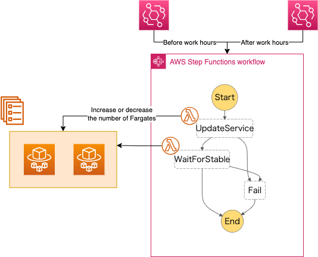

# ecs_number_controller
This Cloud Formation template is designed to increase and decrease the number of ECS Services.
The motivation is to reduce the cost of ECS Service by reducing the number of ECS Service during the night. 
If you stop your Fargate(1 vCPU, 2.00 GB) on half of day (meaning out of working time), you can reduce about 22.18 USD per month due to [AWS Pricing Calculator](https://calculator.aws/)🤩！

This template is effective in these cases
- You are running Fargate in a test or staging environment.
- Your application is not a 24 hour service.
- The traffic is not so high during the night. (But this can be solved by using [AWS Auto Scaling](https://aws.amazon.com/autoscaling/))

## Architecture

## How it works
1. EventBridge triggers the Step Functions at a specified time.
2. The Step Functions then execute the UpdateService Lambda function, updating the number of ECS services.
3. If the previous step is successful, the Step Functions execute the WaitForStable Lambda function to wait for the ECS Service to stabilize.

## Usage
You can give it a try by under [quick-create links](https://docs.aws.amazon.com/AWSCloudFormation/latest/UserGuide/cfn-console-create-stacks-quick-create-links.html).

https://ap-northeast-1.console.aws.amazon.com/cloudformation/home?region=ap-northeast-1#/stacks/create/review?templateURL=https://cf-okamos-ecs-number-controller.s3.ap-northeast-3.amazonaws.com/main.yaml&stackName=ECSNumberController

### Parameters
| Parameter | Description | Default |
|:-----------|:------------|:------------|
| ClusterName | The name of the ECS cluster you need to manage. | |
| ServiceName | The name of the ECS service for which you want to update the number. | |
| ECSRegion | The region of the ECS service. | ap-northeast-1 |
| DayCount | The number of ECS service needed during the day. | 1 |
| NightCount | The number of ECS service needed during the night. | 0 |
| DayStartTime | The time(UTC) to start ECS service during the day. | 8 |
| NightStartTime | The time(UTC) to stop ECS service during the night.  | 21 |

## License

[MIT](https://choosealicense.com/licenses/mit/)
